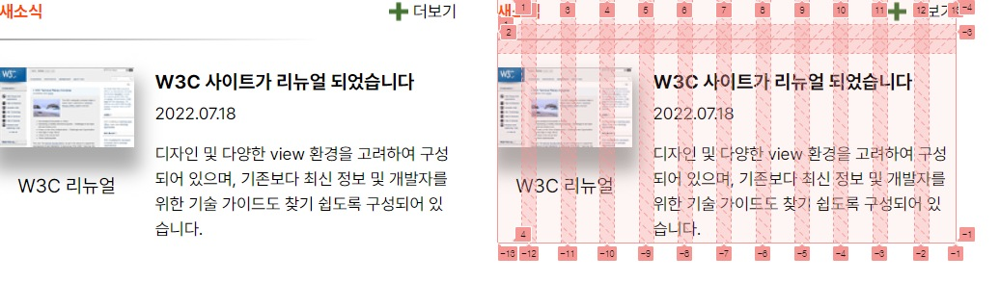

# Mission-04

**Mission-04**

- [Subject](#subject)
- [Markup](#markup)
- [CSS](#CSS)
- [Result](#result)


## Subject

figma 시안을 구현한 결과물 (grid 활용)


## Markup

```html
<!DOCTYPE html>
<html lang="ko-KR">
<head>
  <meta charset="UTF-8" />
  <meta name="viewport" content="width=device-width, initial-scale=1.0" />
  <link rel="stylesheet" as="style" crossorigin href="https://cdn.jsdelivr.net/gh/orioncactus/pretendard@v1.3.7/dist/web/static/pretendard.css" />
  <link rel="stylesheet" href="./grid.css" />
  <title>그리드 과제</title>
</head>
<body>
  
<section class="container">
  <h2 class="head">...</h2>
  <a href="0" class="more"><span>...</span></a>
  
  <!-- <div class="line"></div> -->

  <figure class="img">
    
    <figcaption>...</figcaption>
  </figure>


  <div class="site">
    <h3>...</h3>
    <p class="date">...</p>
    <p class="note">...</p>
  </div>
</section>
</body>
</html>
```


### 설명

1번째 방법


1. container 를 섹션으로 묶고 4개로 나눠주었습니다. <br> (head, more, img, site)


2. 4개에 class name을 주고 나눈 5개의 요소에 값을 넣어 주었습니다.


2번째 방법

line 요소를 주석으로 처리하고
css에 가상 클래스를 주어 line을 처리했습니다.


## CSS

```CSS
body {
  font-family: "Pretendard Variable", Pretendard, -apple-system, BlinkMacSystemFont, system-ui, Roboto, "Helvetica Neue", "Segoe UI", "Apple SD Gothic Neo", "Noto Sans KR", "Malgun Gothic", "Apple Color Emoji", "Segoe UI Emoji", "Segoe UI Symbol", sans-serif;
}


* {
  margin: 0;
  padding: 0;
  box-sizing: border-box;
}

h2, a, figcaption, h3, p {
  line-height: 150%;
}


/* 메인 박스 */

.container {                         /** 부모상자 */
  width: 380px;
  position: relative;
  display: grid;
  gap: 12px;
  grid-template-columns: repeat(12, 1fr);
  grid-template-rows: auto;
  grid-template-areas:
  "head head . . . . . . . . more more"
  "line line line line line line line line line . . ."
  "img img img img site site site site site site site site";
}

/* 헤드 */

.head {                                  /** 움직일 아이템 */
  color: orangered;
  font-size: 14px;
  grid-area: head;
}

/* 더보기 */


.more {                                   /** 움직일 아이템 */
  color: black;
  text-decoration: none;
  font-size: 14px;
  grid-area: more;
  width: 57px;
  display: flex;
  gap: 4px;
  align-items:center;
}

.plus {
  width: 16px;
  height: 16px;
  
}


/* 줄 */ /** 움직일 아이템 */

/* .line {                                       
  width: 266px;
  height: 1px;
  background: linear-gradient(90deg, #A9A9A9 -1.32%, #FFFFFF 100%);
  grid-area: line;

} */


/* 뉴스 */

.img {                                          /** 움직일 아이템 */
  width: 112px;
  grid-area: img;
  padding-top: 12px;

}

.shadow {
  box-shadow: 0px 15px 15px 5px #AAAAAA;
}

figcaption {
  padding-top: 16px;
  text-align: center;
}


/* 사이트 */

.site {                                           /** 움직일 아이템 */
  grid-area: site;
  padding-top: 12px;

}


h3{
  font-size: 16px;
  padding-bottom: 4px;
}

.date {
  font-size: 14px;
  padding-bottom: 12px;

}

.note {
  font-size: 14px;
}


/* 가상요소 */

section.container:after {
display: block;
position: absolute;
content: "";
width : 266px;
height: 1px;
background: linear-gradient(90deg, #A9A9A9 -1.32%, #FFFFFF 100%);
top: 33px;
}

```

### 설명

1번째 방법

주석 처리가 된 HTML,CSS line을 풀고 가상요소를 주석처리를 해도 똑같이 출력 됩니다.


2번째 방법

1번째 방법과 반대로 처리합니다.


## Result




