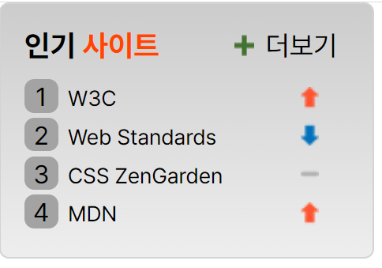

# Mission-05

**Mission-05**

- [Subject](#subject)
- [Markup](#markup)
- [CSS](#CSS)
- [Result](#result)


## Subject

figma 시안을 구현한 결과물 (sprite 활용)


## Markup

```html
<!DOCTYPE html>
<html lang="ko-KR">
  <head>
    <meta charset="UTF-8" />
    <meta name="viewport" content="width=device-width, initial-scale=1.0" />
    <link
      rel="stylesheet"
      as="style"
      crossorigin
      href="https://cdn.jsdelivr.net/gh/orioncactus/pretendard@v1.3.7/dist/web/static/pretendard.css"
    />
    <link rel="stylesheet" href="./sprite.css" />
    <title>sprite 과제</title>

  </head>
  <body>
    <section class="container">
      <h1 class="head">인기 <span class="head__site">사이트</span></h1>

      <a href="0" class="more">
      
      <span>더보기<span>
      </a>

      <ol class="site">
        <li class="site__list1 style styleList1">W3C</li>
        <li class="site__list2 style styleList2">Web Standards</li>
        <li class="site__list3 style styleList3">CSS ZenGarden</li>
        <li class="site__list4 style styleList4">MDN</li>
      </ol>
    </section>
  </body>
</html>

```


### 설명

1. 전체 태그를 묶기위해 `<section>`태그를 사용하고 class를 container 로 지정

2. `h1` 태그에 `span` 태그로 스타일링을 해주고 `h1` 태그에 grid를 위한 class 를 지정

3. `a` 태그에 grid 를 위해 class 를 지정하고 img도 지정

4. ol 태그만들고 grid 사용을 위해 class 지정

5. li 에 sprite 스타일링을 위한 각자의 class를 지정


## CSS

```CSS
body {
  font-family: "Pretendard Variable", Pretendard, -apple-system, BlinkMacSystemFont, system-ui, Roboto, "Helvetica Neue", "Segoe UI", "Apple SD Gothic Neo", "Noto Sans KR", "Malgun Gothic", "Apple Color Emoji", "Segoe UI Emoji", "Segoe UI Symbol", sans-serif;
}

* {
  margin: 0;
  padding: 0;
  box-sizing: border-box;
}

.container {
  background: linear-gradient(180deg, #CCCCCC 0%, #EEEEEE 100%);
  border: 1px solid lightgrey;
  border-radius: 5px;
  padding: 12px;
  width: 190px;
  display: grid;
  grid-template-columns: repeat(2,1fr);
  grid-template-rows: auto;
  gap: 8px;
  grid-template-areas: 
  "head more"
  "site site";
}

.head {         
font-size: 15px;
grid-area: head;
}

.head__site {
  color: orangered;
}

.more {                     
  color: black;
  font-size: 14px;
  padding-left: 20px;
  text-decoration: none;
  align-items: center;
  display: flex;
  grid-area: more;
}

.more__plus {
  width: 16px;
  padding-right: 6px;
}

.site {
  font-size: 11px;
  grid-area: site;
  line-height: 170%;
  list-style: none;
  counter-reset: list-counter;
}

.style {
  background: url(./image/rank.png) no-repeat;
  counter-increment: list-counter;
}

.styleList1 {
  background-position: 140px 4px;
}

.styleList2 {
  background-position: 140px -41px;
}

.styleList3 {
  background-position: 140px -18px;
}

.styleList4 {
  background-position: 140px 4px;
}


li::before {
  content:counter(list-counter);
  width: 17px;
  height: 17px;
  background: #A3A3A3;
  border-radius: 5px;
  font-size: 13px;
  display: inline-block;
  text-align: center;
  margin-right: 5px;
}

```

### 설명

1. container 값 안에 grid를 주고 스타일링을 해준 다음에 gird-areas를 설정

2. 각 클라스에 스타일링

3. style class에 img 를 삽입하고 sprite 를 위해 no-repeat

4. styleList1 ~ 4 까지 계산한 px 값으로 지정

5. list style을 위해서 가상요소를 지정

6. ol class인 site 에 counter-reset: list-counter 지정

7. li의 전체 class 인 style에 하나씩 증가한다는 counter-increment: list-counter를 지정

8. li 에 가상요소를 설정 한 후 스타일링

## Result




